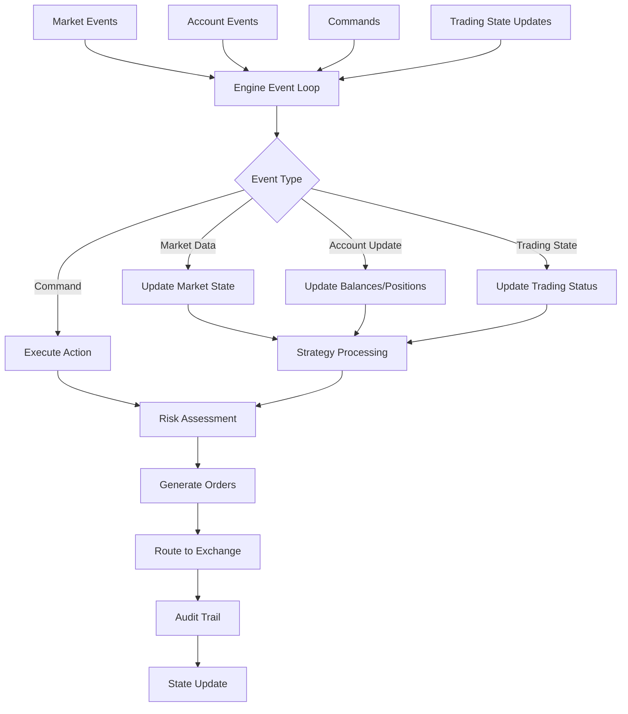

# Tucano Core Module

> This initial section was added to contextualize the Brazilian scope (B3 / ProfitDLL) and the current implementation status. The original English content remains below as comprehensive documentation.

## 🇧🇷 Overview (B3 / Brazilian Market)
The **Core** module is the "brain" of the Tucano platform. It coordinates state, events, and orchestrates the interaction between Strategy, Risk, Execution, Data, Metrics, and Markets. Here, algorithmic trading of B3 stocks and derivatives (stocks, index, mini-index, dollar, mini-dollar, bitcoin futures, gold, etc.) will be consolidated in a unified way.

## 🎯 Role in the Architecture
| Responsibility         | Description                                                                 |
|------------------------|-----------------------------------------------------------------------------|
| Event Engine           | Loop that receives MarketEvents / AccountEvents / Commands and applies atomic state mutations |
| State Management       | Optimized structures to track positions, orders, balances, connectivity, and clocks |
| Execution Routing      | Uses `ExecutionTxMap` / `MultiExchangeTxMap` to address orders to each venue (e.g., ProfitDLL → B3) |
| Strategy Integration   | Applies signals generated by strategy traits (strategy crate) in the event flow |
| Risk Hooks             | Invokes validators defined in the `risk` crate before submitting orders      |
| Auditing               | Emits audit events (for metrics, replay, compliance)                        |
| Backtest / Live Abstraction | Same API for simulation and live trading, changing only the clock and data source |

## 🔑 Main Structures / Traits
- `Engine` – Central orchestrator, drives event processing.
- `EngineState` – Canonical state (positions, orders, balances, instruments, trading state).
- `ExecutionTxMap` / `MultiExchangeTxMap` – Compatibility layer for keys (`ExchangeId` internal vs external `String`) and routing.
- `AccountEvent` / `MarketEvent` (via external crates) – Unify data inputs and account updates.
- `TradingState` – Atomically enables/disables algorithmic trading.
- `Audit` (module) – Emits structured events for traceability.
- `SyncShutdown` & safe shutdown mechanisms.

## 🧬 Internal Dependencies
| Depends on      | Reason                                                        |
|-----------------|---------------------------------------------------------------|
| markets         | Types for Exchange/Instrument/Assets (including B3)           |
| execution       | Order request channel + mock / indirect ProfitDLL abstraction |
| data            | Market stream events and snapshots                            |
| strategy        | Callbacks / signal generation                                 |
| risk            | Pre-execution validations                                     |
| integration     | Channels / generic messaging protocol                         |
| analytics       | Performance metrics / result aggregation                      |

## ✅ Completed (Current State)
- Key compatibility rollback for post-refactor stabilization (String ↔ ExchangeId) completed.
- Central state structures compiling without errors.
- Mock execution support working for tests.
- Connectable audit infrastructure.
- Extensive English documentation maintained (below) for further details.

## 🧪 Partially Implemented
- Backtest: base structure present; needs enrichment with real B3 historical feed.
- Real multi-exchange: only B3 (via ProfitDLL) in progress; other future exchanges (derivatives/crypto) not integrated.
- Advanced real-time latency and PnL metrics: partial placeholders.
- Circuit breaker/connectivity failover: design planned, minimal implementation.

## 🚧 Pending / Roadmap
- Definitively unify `ExchangeId` (remove temporary compatibility layer) when external indices are stable.
- Implement incremental persistence (journaling) for fast recovery.
- Plug-in layer for custom clocks (e.g., micro-latency simulation).
- Orchestration of multiple strategies with capital partitioning.
- Bridge for multiple ProfitDLL brokers (test latency/robustness variations).
- Additional risk hooks (sector exposure, issuer concentration) specific to B3.

## 🧾 Note
This section summarizes the current state focused on the Brazilian market. The rest of the README (below) keeps the original detailed English descriptions for comprehensive reference.

---

The **Core** module is the central orchestration layer of the Tucano algorithmic trading framework. It provides the main trading engine, system coordination, execution management, and foundational components that enable professional-grade live trading, paper trading, and backtesting capabilities.

## 🏗️ Architecture Overview

```text
┌──────────────────────────────────────────────────────────────────┐
│                         CORE MODULE                              │
├─────────────────┬─────────────────┬─────────────────┬────────────┤
│     ENGINE      │     SYSTEM      │   EXECUTION     │ BACKTEST   │
│                 │                 │                 │            │
│ • Event Engine  │ • Configuration │ • Request Router│ • Market   │
│ • State Manager │ • System Builder│ • Account Mgmt  │   Replay   │
│ • Order Process │ • Multi-Exchange│ • Balance Track │ • Strategy │
│ • Audit Trail   │   Coordination  │ • Error Handle  │   Testing  │
│ • Risk Controls │ • Shutdown Mgmt │ • Multi-Exchange│ • Analytics│
└─────────────────┴───────────┬─────┴─────────────────┴────────────┘
                              │
┌─────────────────────────────┴────────────────────────────────────┐
│              INTEGRATIONS WITH OTHER MODULES                     │
├──────────────────────────────────────────────────────────────────┤
│ 📊 analytics    │ 🔄 execution   │ 📈 data       │ 🎯 strategy │
│ 🏪 markets      │ 🔗 integration │ ⚠️  risk      │ 🧩 macros   │
└──────────────────────────────────────────────────────────────────┘
```

## 🎯 Key Features

### 🚀 High-Performance Trading Engine
- **Event-Driven Architecture**: Processes market events, account updates, and commands in real-time
- **Multi-Exchange Support**: Simultaneous trading across multiple exchanges
- **State Management**: Comprehensive tracking of positions, balances, and orders
- **Audit Trail**: Complete record of all trading activities for compliance and analysis

### 🔧 System Configuration & Building
- **Flexible Configuration**: Easy setup for different trading environments
- **Builder Pattern**: Ergonomic system construction with sensible defaults
- **Modular Design**: Mix and match components based on your needs
- **Environment Adaptation**: Seamless switching between live, paper, and backtest modes

### 📊 Execution Management
- **Smart Order Routing**: Intelligent request distribution across exchanges
- **Account Synchronization**: Real-time balance and position tracking
- **Error Handling**: Robust error recovery and retry mechanisms
- **Performance Monitoring**: Execution latency and success rate tracking

### 📈 Backtesting Framework
- **Historical Simulation**: Replay market data with precise timing
- **Strategy Validation**: Test trading algorithms against historical data
- **Performance Analytics**: Comprehensive metrics and risk analysis
- **Multi-Strategy Testing**: Compare and optimize multiple strategies

## 🗂️ Module Structure

### 📁 Core Components

#### 🚀 **Engine** (`src/engine/`)
The heart of the trading system that processes events and coordinates all trading operations.

- **`mod.rs`** - Main engine implementation with event processing loop
- **`action/`** - Engine actions (order generation, position management, cancellations)
- **`audit/`** - Audit trail system for tracking all engine operations
- **`clock.rs`** - Timing interface supporting both real-time and historical clocks
- **`command.rs`** - Command system for external control (shutdown, position management)
- **`execution_tx.rs`** - Multi-exchange transmission mapping for order routing
- **`run.rs`** - Engine execution runners for different operational modes
- **`state/`** - Complete engine state management (positions, orders, balances)

#### ⚙️ **System** (`src/system/`)
High-level system coordination and configuration management.

- **`mod.rs`** - System orchestration and component coordination
- **`builder.rs`** - Ergonomic system builder with fluent configuration API
- **`config.rs`** - Configuration structures for system setup

#### 🔄 **Execution** (`src/execution/`)
Multi-exchange execution management and order routing.

- **`mod.rs`** - Execution coordination and account stream management
- **`builder.rs`** - Builder for setting up multi-exchange execution links
- **`manager.rs`** - Per-exchange execution managers handling order lifecycle
- **`request.rs`** - Execution request types and routing logic
- **`error.rs`** - Execution-specific error types and handling

#### 📈 **Backtest** (`src/backtest/`)
Historical simulation and strategy testing framework.

- **`mod.rs`** - Backtesting coordination and multi-strategy testing
- **`market_data.rs`** - Historical market data loading and replay
- **`summary.rs`** - Backtest result analysis and performance reporting

#### 🛠️ **Utilities**
- **`error.rs`** - Central error type aggregating all core subsystem errors
- **`logging.rs`** - Structured logging configuration with audit filtering
- **`shutdown.rs`** - Graceful shutdown traits and coordination
- **`lib.rs`** - Public API exports and core type definitions

## 🔗 Module Integrations

### 📊 **Analytics Integration**
```rust
// Performance analysis and risk metrics
use analytics::{
    summary::TradingSummaryGenerator,
    metric::{sharpe::SharpeRatio, drawdown::MaxDrawdown},
};

let summary = TradingSummaryGenerator::init();
let sharpe = summary.calculate_sharpe_ratio();
```

### 📈 **Data Integration**
```rust
// Market data processing and event streams
use data::{
    event::{MarketEvent, DataKind},
    streams::consumer::MarketStreamEvent,
};

// Process market events through the engine
engine.process(MarketEvent::Trade(trade_data)).await?;
```

### 🎯 **Strategy Integration**
```rust
// Algorithmic trading strategy implementation
use strategy::{
    AlgoStrategy, ClosePositionsStrategy,
    OnDisconnectStrategy, OnTradingDisabled,
};

// Register strategy with the engine
let strategy = MyAlgoStrategy::new();
engine.register_strategy(strategy);
```

### 🔄 **Execution Integration**
```rust
// Order execution and account management
use execution::{
    order::{OrderRequest, OrderStatus},
    balance::Balance,
    trade::Trade,
};

// Send order through execution system
let request = OrderRequest::market_buy(symbol, quantity);
execution_manager.send(request).await?;
```

### 🏪 **Markets Integration**
```rust
// Exchange and instrument definitions
use markets::{
    exchange::ExchangeId,
    instrument::Instrument,
    Side, OrderType,
};

// Configure supported exchanges
let binance = ExchangeId::new("binance");
let kraken = ExchangeId::new("kraken");
```

### ⚠️ **Risk Integration**
```rust
// Risk management and position sizing
use risk::{
    RiskManager, PositionSizer,
    check::{MaxPositionSize, MaxDrawdown},
};

// Apply risk checks before order execution
let risk_check = risk_manager.validate_order(&order_request)?;
```

## 🚀 Quick Start Guide

### Basic Engine Setup

```rust
use core::{
    engine::Engine,
    system::{SystemBuilder, SystemConfig},
    execution::builder::ExecutionBuilder,
};

#[tokio::main]
async fn main() -> Result<(), Box<dyn std::error::Error>> {
    // Initialize logging
    core::logging::init_logging();
    
    // Configure system
    let config = SystemConfig::builder()
        .add_exchange("binance")
        .add_strategy(my_strategy)
        .build();
    
    // Build and run system
    let system = SystemBuilder::new(config)
        .build()
        .await?;
    
    system.run().await?;
    Ok(())
}
```

### Backtesting Example

```rust
use core::{
    backtest::{BacktestMarketData, run_backtest},
    system::SystemConfig,
};
use analytics::time::TimeInterval;

#[tokio::main]
async fn main() -> Result<(), Box<dyn std::error::Error>> {
    // Load historical data
    let market_data = BacktestMarketData::load_csv("data/BTCUSDT_1h.csv").await?;
    
    // Configure strategy
    let config = SystemConfig::builder()
        .add_strategy(my_strategy)
        .backtest_mode()
        .build();
    
    // Run backtest
    let results = run_backtest(
        config,
        market_data,
        TimeInterval::days(30),
    ).await?;
    
    // Analyze results
    println!("Sharpe Ratio: {:.2}", results.sharpe_ratio());
    println!("Total Return: {:.2}%", results.total_return() * 100.0);
    
    Ok(())
}
```

### Multi-Exchange Trading

```rust
use core::{
    system::SystemBuilder,
    execution::builder::ExecutionBuilder,
};

#[tokio::main]
async fn main() -> Result<(), Box<dyn std::error::Error>> {
    // Configure multi-exchange execution
    let execution = ExecutionBuilder::new()
        .add_exchange("binance", binance_config)
        .add_exchange("kraken", kraken_config)
        .add_exchange("coinbase", coinbase_config)
        .build()
        .await?;
    
    // Build trading system
    let system = SystemBuilder::new()
        .with_execution(execution)
        .add_strategy(arbitrage_strategy)
        .build()
        .await?;
    
    // Start trading across all exchanges
    system.run().await?;
    Ok(())
}
```

## 📋 Event Processing Flow

```text
┌─────────────────────────────────────────────────────────────────┐
│                    EVENT PROCESSING FLOW                       │
└─────────────────────────────────────────────────────────────────┘

📈 Market Data Event
        │
        ▼
┌───────────────┐    🎯 Strategy Analysis    ┌─────────────────┐
│ Engine Event  │ ────────────────────────► │ Algo Strategy   │
│ Processor     │                           │ Signal Gen      │
└───────────────┘                           └─────────────────┘
        │                                           │
        ▼                                           ▼
┌───────────────┐    ⚠️ Risk Assessment      ┌─────────────────┐
│ State Update  │ ◄─────────────────────────► │ Risk Manager    │
│ (Positions,   │                           │ Position Check  │
│  Balances)    │                           └─────────────────┘
└───────────────┘                                   │
        │                                           ▼
        ▼                                   ┌─────────────────┐
┌───────────────┐    🔄 Order Routing       │ Execution       │
│ Audit Trail   │ ◄─────────────────────────► │ Request Router  │
│ Logging       │                           │ (Multi-Exchange)│
└───────────────┘                           └─────────────────┘
                                                   │
                                                   ▼
                                           ┌─────────────────┐
                                           │ Exchange APIs   │
                                           │ (Binance,       │
                                           │  Kraken, etc.)  │
                                           └─────────────────┘
```

## 🧪 Testing

The core module includes comprehensive test utilities for unit and integration testing:

```rust
use core::test_utils::{
    trade, asset_state, time_plus_days,
    f64_is_eq,
};

#[cfg(test)]
mod tests {
    use super::*;
    
    #[test]
    fn test_engine_processes_trade() {
        let trade = trade(
            Utc::now(),
            Side::Buy,
            50000.0,  // price
            1.0,      // quantity
            10.0,     // fees
        );
        
        // Test trade processing logic
        assert!(f64_is_eq(trade.price.into(), 50000.0, 0.01));
    }
}
```

## 🔧 Configuration

### Environment Variables

```bash
# Logging configuration
export RUST_LOG=info                    # Default log level
export RUST_LOG=core=debug,execution=info  # Module-specific levels

# System configuration
export TOUCAN_CONFIG_FILE=config.toml   # Configuration file path
export TOUCAN_AUDIT_ENABLED=true        # Enable audit trail
export TOUCAN_RISK_ENABLED=true         # Enable risk management
```

### Configuration File Example

```toml
[system]
name = "my_trading_system"
mode = "live"  # "live", "paper", or "backtest"
audit_enabled = true
risk_enabled = true

[execution]
default_timeout = "30s"
retry_attempts = 3
max_concurrent_orders = 100

[exchanges.binance]
api_key = "${BINANCE_API_KEY}"
secret_key = "${BINANCE_SECRET_KEY}"
sandbox = false

[exchanges.kraken]
api_key = "${KRAKEN_API_KEY}"
secret_key = "${KRAKEN_SECRET_KEY}"
sandbox = false

[logging]
level = "info"
format = "json"  # "json" or "pretty"
audit_filter = true
```

## 🛡️ Error Handling

The core module provides comprehensive error handling through the `TucanoError` type:

```rust
use core::error::TucanoError;

match trading_result {
    Ok(success) => println!("Trade executed: {:?}", success),
    Err(TucanoError::MarketData(data_err)) => {
        eprintln!("Market data issue: {}", data_err);
        // Handle data connectivity issues
    },
    Err(TucanoError::Execution(exec_err)) => {
        eprintln!("Execution failed: {}", exec_err);
        // Handle order execution failures
    },
    Err(TucanoError::IndexError(index_err)) => {
        eprintln!("Invalid instrument/exchange: {}", index_err);
        // Handle configuration issues
    },
    Err(err) => eprintln!("System error: {}", err),
}
```

## 📚 Additional Resources

- **[Engine Documentation](src/engine/README.md)** - Detailed engine implementation guide
- **[System Builder Guide](src/system/README.md)** - System configuration and setup
- **[Execution Management](src/execution/README.md)** - Multi-exchange execution guide
- **[Backtesting Framework](src/backtest/README.md)** - Historical testing and analysis
- **[API Reference](https://docs.rs/toucan-core)** - Complete API documentation

## 🤝 Contributing

When contributing to the core module:

1. **Follow the event-driven pattern** - All operations should be event-based
2. **Maintain state consistency** - Ensure proper state management across components
3. **Add comprehensive tests** - Include unit tests for all new functionality
4. **Document integration points** - Clearly document how components interact
5. **Performance considerations** - Core operations should be optimized for low latency

## 📄 License

This module is part of the Tucano trading framework and follows the same licensing terms.
- **`audit/`** - Comprehensive audit trail and state replication
- **`clock.rs`** - Time management for live trading and backtesting
- **`command.rs`** - External command interface (CloseAllPositions, etc.)
- **`execution_tx.rs`** - Execution request transmission coordination
- **`run.rs`** - Engine execution loops and lifecycle management
- **`state/`** - Complete trading state management (positions, orders, balances)

#### ⚙️ **System** (`src/system/`)
System-wide configuration and multi-exchange setup utilities.

- **`builder.rs`** - System builder for multi-exchange configuration
- **`config.rs`** - Configuration structures and validation
- **`mod.rs`** - System coordination and initialization

#### 📨 **Execution** (`src/execution/`)
High-level execution request routing and account management.

- **`builder.rs`** - Execution system builder and configuration
- **`manager.rs`** - Multi-exchange execution coordination
- **`request.rs`** - Execution request types and routing
- **`error.rs`** - Execution-specific error handling

#### 📊 **Backtest** (`src/backtest/`)
Backtesting infrastructure and historical data processing.

- **`market_data.rs`** - Historical market data management
- **`summary.rs`** - Backtest result summarization
- **`mod.rs`** - Backtesting engine coordination

#### 🛠️ **Support Components**

- **`error.rs`** - Centralized error handling across all core systems
- **`logging.rs`** - Structured logging configuration with audit filtering
- **`shutdown.rs`** - Graceful shutdown coordination for all components
- **`lib.rs`** - Public API and core type definitions

## 🔄 Event Processing Flow

The core engine processes events in a structured pipeline:



## 🔌 Module Integrations

### **Data Module Integration**
- **Market Events**: Receives real-time and historical market data
- **Event Streams**: Processes order books, trades, and market updates
- **Subscriptions**: Manages instrument subscriptions across exchanges

### **Strategy Module Integration**  
- **Algorithmic Orders**: Processes strategy-generated order signals
- **Position Management**: Executes position closing strategies
- **Disconnect Handling**: Manages strategy behavior during disconnections

### **Execution Module Integration**
- **Order Routing**: Routes execution requests to appropriate exchanges
- **Balance Tracking**: Maintains real-time balance state
- **Trade Settlement**: Processes trade confirmations and updates

### **Analytics Module Integration**
- **Performance Metrics**: Feeds trading data to analytics engine
- **Risk Metrics**: Provides data for risk calculation
- **Tear Sheets**: Generates performance summaries

### **Risk Module Integration**
- **Request Filtering**: Validates orders against risk rules
- **Position Limits**: Enforces position size and exposure limits
- **Real-time Monitoring**: Continuous risk assessment

### **Markets Module Integration**
- **Exchange Definitions**: Uses exchange configurations and capabilities
- **Instrument Mapping**: Maps instruments across different exchanges
- **Asset Management**: Handles multi-asset portfolio management

## 🚀 Getting Started

### Basic Engine Setup

```rust
use core::{
    engine::Engine,
    system::SystemBuilder,
    EngineEvent,
    logging::init_logging,
};

#[tokio::main]
async fn main() -> Result<(), Box<dyn std::error::Error>> {
    // Initialize logging
    init_logging();
    
    // Build the trading system
    let system = SystemBuilder::new()
        .add_exchange(/* exchange config */)
        .add_strategy(/* strategy config */)
        .build()
        .await?;
    
    // Create and run the engine
    let mut engine = Engine::new(system);
    
    // Process events
    while let Some(event) = event_stream.next().await {
        engine.process(event).await?;
    }
    
    Ok(())
}
```

### Event Processing

```rust
use core::{EngineEvent, engine::command::Command};

// Create various engine events
let market_event = EngineEvent::from(market_data);
let account_event = EngineEvent::from(account_update);
let command_event = EngineEvent::from(Command::CloseAllPositions);
let shutdown_event = EngineEvent::shutdown();

// Process through engine
engine.process(market_event).await?;
```

### Multi-Exchange Configuration

```rust
use core::system::{SystemBuilder, config::ExchangeConfig};

let system = SystemBuilder::new()
    .add_exchange(ExchangeConfig {
        name: "binance".to_string(),
        // ... other config
    })
    .add_exchange(ExchangeConfig {
        name: "kraken".to_string(),
        // ... other config  
    })
    .build()
    .await?;
```

## 🔧 Configuration

### Engine Configuration

The engine can be configured for different operational modes:

- **Live Trading**: Real-time market data and execution
- **Paper Trading**: Simulated execution with real market data
- **Backtesting**: Historical data replay with performance analysis

### System Builder Options

- **Multi-Exchange Support**: Connect to multiple exchanges simultaneously
- **Strategy Loading**: Configure algorithmic trading strategies
- **Risk Management**: Set up risk rules and limits
- **Audit Configuration**: Enable detailed audit trails

## 📈 Performance Considerations

- **Event Processing**: Optimized for high-frequency event processing
- **Memory Management**: Efficient state management for long-running systems
- **Concurrent Execution**: Multi-exchange parallel processing
- **Audit Overhead**: Configurable audit detail levels

## 🔍 Monitoring and Debugging

### Audit Trail
- Complete event processing history
- State change tracking
- Performance metrics collection

### Logging
- Structured logging with configurable levels
- JSON output for log aggregation systems
- Automatic filtering of verbose internal operations

### Error Handling
- Comprehensive error taxonomy
- Graceful degradation on component failures
- Detailed error context for debugging

## 🧪 Testing

The core module includes extensive test utilities:

- **Test Fixtures**: Pre-configured test data and scenarios
- **Mock Components**: Simulated exchanges and strategies
- **Integration Tests**: End-to-end system testing
- **Performance Tests**: Latency and throughput validation

## 📚 API Reference

### Key Types

- `Engine<T>` - Main trading engine
- `EngineEvent<T>` - Universal event type
- `EngineState` - Complete system state
- `TucanoError` - Comprehensive error type
- `Sequence` - Event sequence tracking

### Key Traits

- `SyncShutdown` - Synchronous component shutdown
- `AsyncShutdown` - Asynchronous component shutdown
- `EngineClock` - Time source abstraction

For detailed API documentation, run:
```bash
cargo doc --package core --open
```

## 🤝 Contributing

When contributing to the core module:

1. **Event Processing**: Ensure new events integrate properly with the processing pipeline
2. **State Management**: Maintain state consistency across all operations
3. **Error Handling**: Use the centralized error types and provide context
4. **Testing**: Include comprehensive tests for new functionality
5. **Documentation**: Update this README and add inline documentation

## 📄 License

This module is part of the Tucano trading framework. See the main project license for details.
